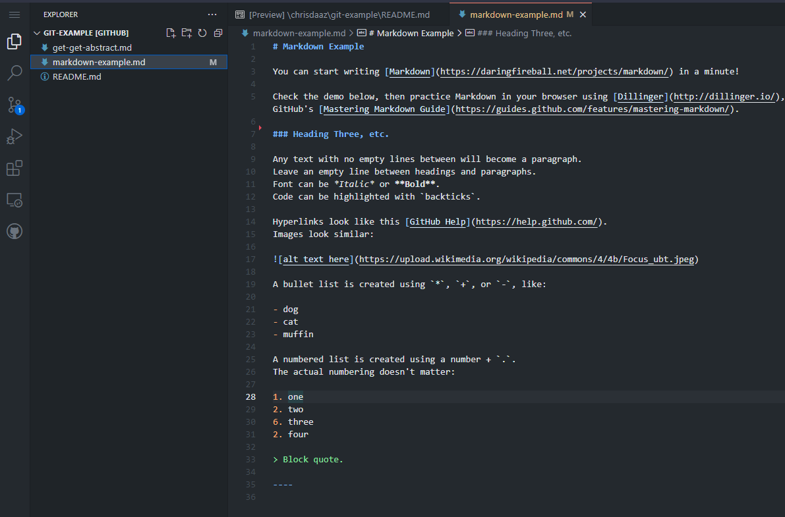
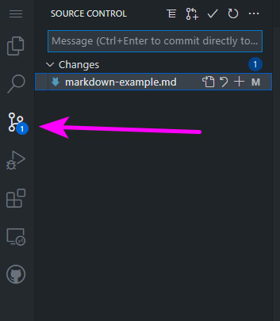
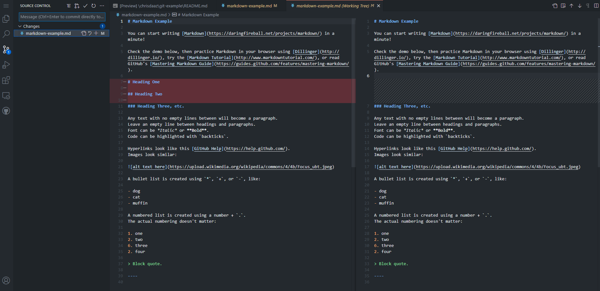
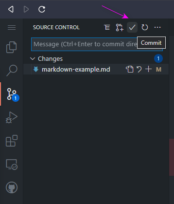
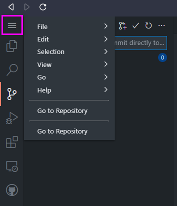

# Getting Started

Let's take a look at an example repository on GitHub and then get Git configured on your local computer.

## GitHub Web Interface

Log in to [GitHub](images/https://github.com){:target="_blank"} and go to the [git-example repository](images/https://github.com/uidaholib/git-example){:target="_blank"}.

The main page of a repository is the "Code" tab, which has a representation of the files, and displays the `README`.
Follow this demo to explore the basic features of the GitHub interface and start to understand the concept of a version controlled project:

1. Click the "Fork" button in the upper right--you now have your own personal version of the repo! [Forking](images/https://guides.github.com/activities/forking/){:target="_blank"} is a GitHub concept that allows you to create a new copy of a repository to your account, yet maintain a connection so that changes can be sent back to the original via "Pull Requests" (PR). It is a common workflow for collaborating on bigger projects.

2. On your `git-example` web page, click the "Commits" button below the description. The Commits page allows you to review and navigate the entire history of the repo.

3. Click back on the "Code" tab, then press the `.` key on your keyboard. This will open up a web version of the [Visual Studio Code](images/https://code.visualstudio.com/) editor. 



> Note: in case this looks different in your browser, these screenshots are using one of [GitHub's dark themes](https://docs.github.com/en/account-and-profile/setting-up-and-managing-your-github-user-account/managing-user-account-settings/managing-your-theme-settings)

4. Click on one of the file names in the left sidebar. This will display the file's contents on the page, which is text written in [Markdown](images/https://www.markdownguide.org/). 

5. Make some changes or add some new text 

6. In the left sidebar, click on the source control icon (which should have a number that represents the number of files that have changed within the project).



7. Click on the file name beneath the "Changes" heading. You will see two versions of the file side by side: the left side representing the changes made to the *original* version and the right side representing the *current* version of the file. 



8. When you're satisfied with the changes, enter a commit message and click on the check mark icon to "Commit" the changes to your repository. Commit messages are little notes explaining the rationale for the changes in order to help others (and your future self!) understand the history of the project.



9. Congrats! You just made your first commit--you used Git! You added one snapshot to the history.

10. Click menu icon in the upper-left and select "Go to Repository" to exit the editor and to view your updated history.



> Note: GitHub allows [Markdown](images/https://guides.github.com/features/mastering-markdown/){:target="_blank"} formating for READMEs and comments through out the site.

## Create a New Repository

The most common way to work with Git is to create or fork a repository on GitHub, then `clone` it to your local machine.
You will then work on the files locally, before using `push` to send your changes to the "remote" repository.
To create a new remote repository:

1. Click the plus sign on the upper right and select "New repository" from the drop down
2. Give it a nice name
3. Check "Initialize this repository with a README"
4. Click "Create repository"

> Every GitHub repo has handy project management features that are built in. 
> Check the [Issues](https://guides.github.com/features/issues/){:target="_blank"}, Projects, and Wiki tabs to start organizing your work!
> To delete a repository, click on the "Settings" tab and scroll down to the bottom to find the delete button.

## Git Config

To start learning Git we will use it on the command line.
Although there are GUI clients to manage Git repositories, being familiar with the command line version will help you better understand the basic workflow.
If you need a command line refresher, check out this [mini-lesson](https://programminghistorian.org/en/lessons/intro-to-bash){:target="_blank"}.
So fire up your favorite shell, terminal, or Git Bash to get started!

Some initial setup is necessary the first time you use Git on a computer.
You will use these commands only once, unless you want to change something.

Set your name and email (matching your GitHub account):

```
git config --global user.name "Chris Diaz"
git config --global user.email "myemail@gmail.com"
```

> Your email and user name is recorded with every commit.
> This helps ensure integrity and authenticity of the history.
> Most people keep their email public, but if you are concerned about privacy, check GitHub's tips to [hide your email](images/https://help.github.com/articles/about-commit-email-addresses/){:target="_blank"}.

Next, set your default text editor. 
The current versions of the Git for Windows installer allow you to set the default editor during [setup](images/{{ '/0-prep.html' | relative_url }}), so Windows users should not need to complete this step and should have Visual Studio Code set as the default editor.

Mac users should set their Git `core.editor` to `"code -w"` as well. 

First, follow [these instructions to "Install 'code' command to PATH"](https://code.visualstudio.com/docs/setup/mac#_launching-from-the-command-line), then set the default editor with this command:

```
git config --global core.editor "code --wait"
```

> Git opens the default editor to ask for commit messages. 
> You are most likely to encounter it when merging.
> If you don't set a default editor, Git will use the default default--which might be surprising if you are not used to terminal-based editors such as [Vim](images/http://www.vim.org/){:target="_blank"}. 
> If you are stuck in Vim and can't figure out how to escape, type `Esc` then `:wq` then `Enter` to save and quit ([VIM quick ref](images/https://w3.cs.jmu.edu/bernstdh/Web/common/help/vim.php){:target="_blank"}, and don't worry, you are [not alone in confusion](images/https://stackoverflow.blog/2017/05/23/stack-overflow-helping-one-million-developers-exit-vim/){:target="_blank"}).

## Create Repository Locally

*P.s.* If you really want to, you can create a local repository:

```
mkdir test
cd test
git init
```

If you want to connect this repository to GitHub, you have to `git remote add`.
Generally, it is easier to create the repo on GitHub first and `clone`, rather than using `init`. However, `init` is useful if you will not be pushing to a remote repo.
